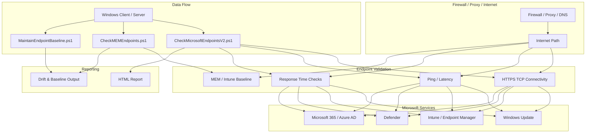

# Microsoft Endpoint Connectivity Tests

[](https://learn.microsoft.com/powershell/)
[](LICENSE)
[]()
[](Info_EN.md)

PowerShell scripts to validate connectivity to Microsoft service endpoints used by Intune, Windows Update, Defender, Microsoft 365, Azure AD, and other enterprise cloud services.

This repository is designed for real-world IT and endpoint troubleshooting: firewall validation, proxy check, network diagnostics, and endpoint accessibility testing from Windows clients and servers.

## Architecture



## Included Scripts

- [CheckMicrosoftEndpointsV2.ps1](CheckMicrosoftEndpointsV2.ps1)  
  Full endpoint connectivity test with selectable services, latency checks, response-time measurement, and optional HTML reporting.

- [CheckMEMEndpoints.ps1](CheckMEMEndpoints.ps1)  
  Focused Microsoft Endpoint Manager / Intune validation with baseline-based testing and legacy API fallback support.

- [MaintainEndpointBaseline.ps1](MaintainEndpointBaseline.ps1)  
  Detects endpoint drift against a saved baseline and can update or enforce drift checks in automation.

- [Info.md](Info.md) and [Info_EN.md](Info_EN.md)  
  Detailed technical documentation with endpoint sources, methodology, and service references.

## Use Cases

- Validate Microsoft cloud connectivity from enterprise networks
- Check firewall, proxy, routing, or DNS-related connectivity issues
- Verify Intune and Endpoint Manager access
- Test Windows Update, Defender, Microsoft 365, Azure AD, Autopatch, and related services
- Generate quick status reports for IT operations teams

## Requirements

- PowerShell 5.1 or later
- Windows 10, Windows 11, or Windows Server 2016+
- Internet access for endpoint testing
- No administrator rights required for most checks

## Quick Start

```powershell
# Change to the repository folder
cd "C:\path\to\CheckMicrosoftEndpoints"

# Interactive service selection
.\CheckMicrosoftEndpointsV2.ps1

# Test all services
.\CheckMicrosoftEndpointsV2.ps1 -Services All

# Test Intune + Defender and generate HTML report
.\CheckMicrosoftEndpointsV2.ps1 -Services Intune,Defender -HtmlReport "Microsoft-Endpoints.html" -OpenReport

# MEM / Intune validation
.\CheckMEMEndpoints.ps1
```

## Supported Service Categories

- Windows Update for Business
- Windows Autopatch
- Microsoft Intune
- Microsoft Defender
- Azure Active Directory
- Microsoft 365
- Microsoft Store
- Windows Activation
- Microsoft Edge
- Windows Telemetry

## HTML Report Example

```powershell
.\CheckMicrosoftEndpointsV2.ps1 -Services All -HtmlReport "NetworkReport.html" -OpenReport
```

This creates a readable HTML report summarizing connectivity state, service results, latency, and response times.

## Baseline Maintenance

```powershell
# Check for drift
.\MaintainEndpointBaseline.ps1

# Update the saved baseline after intentional changes
.\MaintainEndpointBaseline.ps1 -UpdateBaseline

# Fail automation when drift is detected
.\MaintainEndpointBaseline.ps1 -FailOnDrift
```

## Documentation

- [Info_EN.md](Info_EN.md) — technical documentation in English
- [Info.md](Info.md) — technische Doku auf Deutsch

## License

This project is licensed under the [GNU General Public License v3.0](LICENSE).

## Author

Ronny Alhelm

---

<p align="center">
  <strong>Enterprise-ready</strong> ·
  <strong>Microsoft endpoint focused</strong> ·
  <strong>PowerShell based</strong>
</p>

